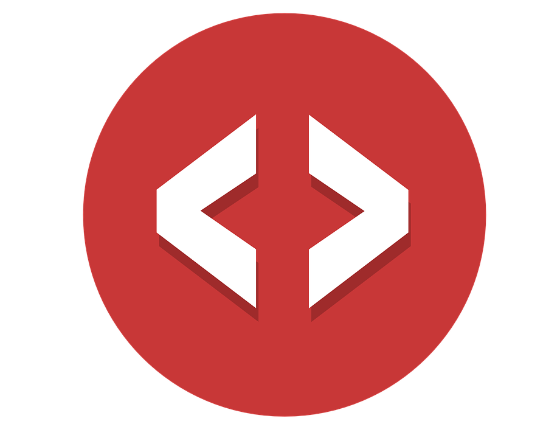

<!-- PROJECT LOGO -->
 

  

  <h3 align="center">DocGen Generator</h3>

  

     
    <a href="https://github.com/Samuel-Hinchliffe/Header-Docblock-Generator"><strong>Explore the docs »</strong></a>
     
     
    <a href="https://github.com/Samuel-Hinchliffe/Header-Docblock-Generator">View Demo</a>
    ·
    <a href="https://github.com/Samuel-Hinchliffe/Header-Docblock-Generator/issues">Report Bug</a>
    ·
    <a href="https://github.com/Samuel-Hinchliffe/Header-Docblock-Generator/issues">Request Feature</a>
  

<!-- TABLE OF CONTENTS -->

  
Table of Contents

  <ol>
    <li>
      <a href="#about-the-project">About The Project</a>
      <ul>
        <li><a href="#built-with">Built With</a></li>
      </ul>
    </li>
    <li><a href="#usage">Usage</a></li>
    <li><a href="#contributing">Contributing</a></li>
    <li><a href="#contact">Contact</a></li>
  </ol>

<!-- ABOUT THE PROJECT -->
## About The Project

[![Product Name Screen Shot][product-screenshot]](https://example.com)

Have you ever wondered who made a file? What does the file do? When it was made? Who owns it and what its licence is? Today we normally just check the Github README.md to find out. It wasn't so long ago that most files had all of these details just at the top of the file. A greeting in the form of documentation. It told us everything we needed to know about this file without having to go deep into the code. 

If you've ever looked back at the code of old legacy systems, especially anything in ASM. You'll see that almost all of them had these header Docblocks that told us everything about the code itself and the details to contact whoever made this

Why would I use this:
* Your want to document your code within PHPDocumentor / JSDoc Standards. 
* Your want to have a Page level doc to let other's know who created it.
* Your want to explain to others the general idea of the file. 
* Your want to improve the documentation in your current codebase. 

(<a href="#top">back to top</a>)

### Built With

* [Vue.js](https://vuejs.org/)
* [Vuetify](https://vuetifyjs.com/en/)
* [Material Design](https://material.io/design)
* [Scss](https://sass-lang.com/)
* [Jest](https://jestjs.io/)

(<a href="#top">back to top</a>)

<!-- USAGE EXAMPLES -->
## Usage

Using this application is straight forward, head to the project online and select the language in which you wish to generate your page level DocBlock. Fill out the form on the left hand side and watch as the card on the right side dynamically change with your changes. Once you're complete, click the copy button on the top right of the right card. Also note that your form input will be saved. It saves to your Local Storage.

(<a href="#top">back to top</a>)

<!-- CONTRIBUTING -->
## Contributing

Contributions are what make the open source community such an amazing place to learn, inspire, and create. Any contributions you make are **greatly appreciated**.

If you have a suggestion that would make this better, please fork the repo and create a pull request. You can also simply open an issue with the tag "enhancement".
Don't forget to give the project a star! Thanks again!

1. Fork the Project
2. Create your Feature Branch (`git checkout -b feature/AmazingFeature`)
3. Commit your Changes (`git commit -m 'Add some AmazingFeature'`)
4. Push to the Branch (`git push origin feature/AmazingFeature`)
5. Open a Pull Request

(<a href="#top">back to top</a>)

<!-- CONTACT -->
## Contact

Samuel Hinchliffe - [Linkedin](https://www.linkedin.com/in/samuel-hinchliffe-%F0%9F%9A%80-2bb5801a5/) - sam.hinchliffe.work@gmail.com

Project Link: [https://github.com/Samuel-Hinchliffe](https://github.com/Samuel-Hinchliffe)

(<a href="#top">back to top</a>)

<!-- MARKDOWN LINKS & IMAGES -->
<!-- https://www.markdownguide.org/basic-syntax/#reference-style-links -->
[contributors-shield]: https://img.shields.io/github/contributors/othneildrew/Best-README-Template.svg?style=for-the-badge
[contributors-url]: https://github.com/othneildrew/Best-README-Template/graphs/contributors
[forks-shield]: https://img.shields.io/github/forks/othneildrew/Best-README-Template.svg?style=for-the-badge
[forks-url]: https://github.com/othneildrew/Best-README-Template/network/members
[stars-shield]: https://img.shields.io/github/stars/othneildrew/Best-README-Template.svg?style=for-the-badge
[stars-url]: https://github.com/othneildrew/Best-README-Template/stargazers
[issues-shield]: https://img.shields.io/github/issues/othneildrew/Best-README-Template.svg?style=for-the-badge
[issues-url]: https://github.com/othneildrew/Best-README-Template/issues
[license-shield]: https://img.shields.io/github/license/othneildrew/Best-README-Template.svg?style=for-the-badge
[license-url]: https://github.com/othneildrew/Best-README-Template/blob/master/LICENSE.txt
[linkedin-shield]: https://img.shields.io/badge/-LinkedIn-black.svg?style=for-the-badge&logo=linkedin&colorB=555
[linkedin-url]: https://linkedin.com/in/othneildrew
[product-screenshot]: src/assets/exampleUse.png
